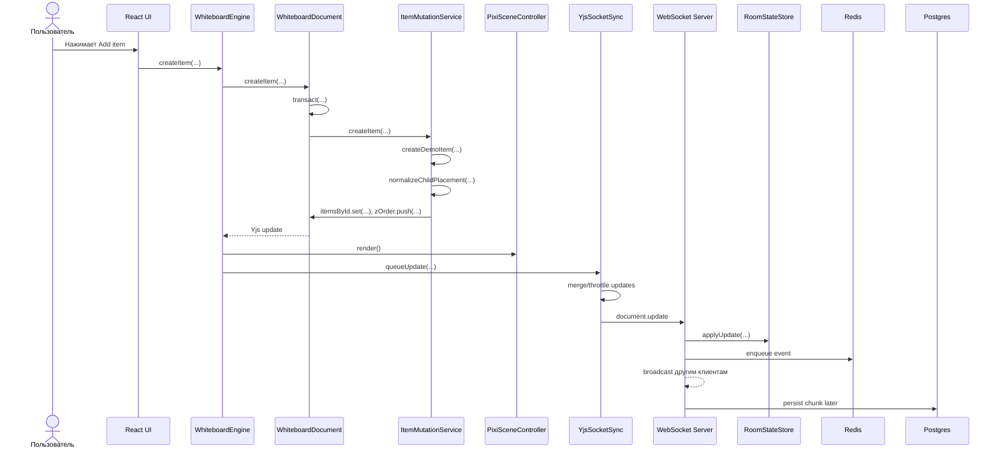
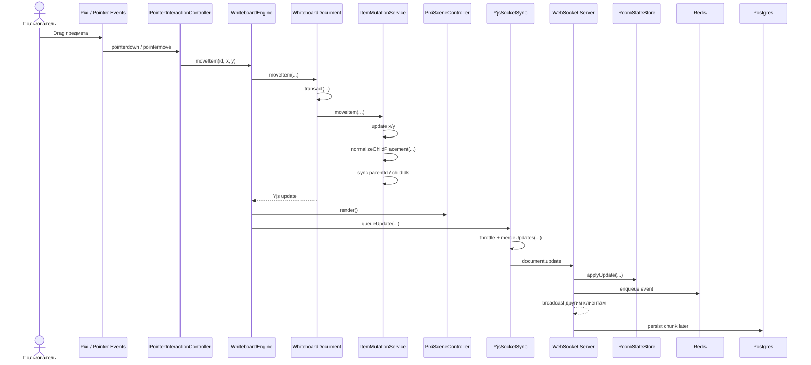

# Флоу Демо Whiteboard

Ниже описан сквозной флоу демки: как создается и перемещается предмет, что делает клиент, движок, сервер, Redis и Postgres.

## Схема: Создание Предмета

## Схема: Перемещение Предмета

## 1. Общая Архитектура

- `client` отвечает только за UI и вызов методов движка.
- `engine` держит локальный `Yjs`-документ, рендерит сцену через `Pixi` и отправляет CRDT updates на сервер.
- `server` принимает бинарные `Yjs` updates, сразу применяет их к серверному room state, ретранслирует другим клиентам и сохраняет события через `Redis -> Postgres`.

Основные файлы:
- `client/src/app/App.tsx`
- `client/src/hooks/useWhiteboardSession.ts`
- `engine/src/core/WhiteboardEngine.ts`
- `engine/src/document/WhiteboardDocument.ts`
- `engine/src/document/ItemMutationService.ts`
- `engine/src/rendering/PixiSceneController.ts`
- `engine/src/sync/YjsSocketSync.ts`
- `server/src/index.ts`
- `server/src/services/event-pipeline.ts`
- `server/src/services/room-state.ts`
- `server/src/storage/redis.ts`
- `server/src/storage/postgres.ts`

## 2. Что Происходит При Старте Клиента

1. React в `useWhiteboardSession.ts` запрашивает `/state`.
2. Сервер отдает `yjsStateBase64` из `RoomStateStore`.
3. Затем создается `WhiteboardEngine` и вызывается `mount(...)`.
4. Движок:
   - монтирует Pixi scene
   - применяет initial `Yjs` state
   - подписывается на `document.onUpdate(...)`
   - открывает WebSocket

## 3. Флоу Создания Предмета

1. Пользователь нажимает кнопку в `Toolbar`.
2. В `App.tsx` вызывается `handleCreate(type)`.
3. Считаются стартовые bounds через `getDefaultCreateBounds(...)`.
4. Вызывается `engine.createItem(...)`.
5. `WhiteboardEngine` делегирует создание в `WhiteboardDocument.createItem(...)`.
6. `WhiteboardDocument` открывает `Yjs transact(...)`.
7. Внутри `ItemMutationService.createItem(...)`:
   - создается plain item через `createDemoItem(...)`
   - item прогоняется через `normalizeChildPlacement(...)`
   - если предмет пересекает frame, ставится `parentId`
   - обновляются `childIds` родителя
   - item записывается в `itemsById`
   - `id` добавляется в `zOrder`
8. После завершения транзакции `Yjs` создает один `update`.
9. В `WhiteboardEngine.mount()` `document.onUpdate(...)`:
   - вызывает локальный `render()`
   - ставит update в очередь отправки через `YjsSocketSync.queueUpdate(...)`
10. `render()` в `PixiSceneController.render(...)`:
    - берет `orderedItems`
    - вычисляет `visibleIds`
    - создает или переиспользует Pixi view
    - обновляет содержимое через `updateView(...)`
    - ставит позицию и `zIndex`
    - добавляет объект на сцену, если он видим

Результат:
- предмет сразу появляется локально
- он уже записан в `Yjs`
- update готов к отправке на сервер

## 4. Флоу Перемещения Предмета

1. Пользователь начинает drag объекта.
2. Pixi `pointerdown` попадает в item view.
3. `PointerInteractionController.beginItemDrag(...)` запоминает:
   - `id` объекта
   - offset курсора относительно объекта
4. На каждом `pointermove` вызывается `engine.moveItem(id, x, y)`.
5. `WhiteboardDocument.moveItem(...)` открывает `transact(...)`.
6. Внутри `ItemMutationService.moveItem(...)`:
   - если двигается контейнер, меняются его `x/y`
   - если двигается child item:
     - считается новая позиция
     - item прогоняется через `normalizeChildPlacement(...)`
     - может измениться `parentId`
     - синхронизируются `childIds` старого и нового родителя
7. Транзакция завершается, Yjs создает update.
8. Движок делает локальный `render()`.
9. Update идет в `queueUpdate(...)`.
10. Sync-слой:
    - троттлит отправку
    - мерджит много updates через `Y.mergeUpdates(...)`
    - отправляет один update по сокету примерно раз в `100ms`

Результат:
- drag локально плавный
- по сети уходят схлопнутые CRDT updates, а не каждый `pointermove`

## 5. Что Делает Сервер С Update

Когда клиент прислал `document.update` по сокету:

1. `server/src/index.ts` получает сообщение.
2. Если это `document.update`, вызывается `eventPipeline.enqueueUpdate(roomId, payloadBase64)`.
3. В `EventPipeline.enqueueUpdate(...)`:
   - update сразу применяется к `RoomStateStore.applyUpdate(...)`
   - событие кладется в Redis через `RedisEventQueue.enqueue(...)`
   - проверяется размер очереди
   - если достигнут `chunkSize`, запускается flush
4. После этого сервер делает `broadcast(...)` всем другим клиентам.

Итого сервер делает две параллельные вещи:
- realtime sync другим клиентам сразу
- persistence через `Redis -> Postgres` отдельно

## 6. Как Другой Клиент Получает Создание Или Перемещение

1. Сервер отправляет второму клиенту `document.update`.
2. У второго клиента `YjsSocketSync` слушает `message`.
3. Он вызывает `onRemoteUpdate(...)`.
4. Это уходит в `document.applyRemoteUpdate(...)`.
5. Yjs применяет update с `REMOTE_ORIGIN`.
6. `document.onUpdate(...)` все равно вызывает `render()`.
7. Но клиент не шлет этот update обратно на сервер, потому что origin удаленный.

Итог:
- второй клиент просто применяет тот же `Yjs` update
- состояние и рендер синхронизируются автоматически

## 7. Что Хранится В Redis

Redis нужен как временный буфер, а не как источник истины.

В `RedisEventQueue`:
- для каждой комнаты есть список `room:{roomId}:events`
- туда через `rPush` кладутся события в порядке прихода
- отдельный set `rooms:active` хранит комнаты, у которых были buffered events

Событие в Redis:
- `payloadBase64` — бинарный Yjs update в base64
- `receivedAt` — timestamp

Когда вызывается `drain(roomId, limit)`:
- Redis читает первые `limit` событий
- сразу обрезает их из списка через `lTrim`
- pipeline получает готовый chunk для записи в Postgres

## 8. Что Записывается В Postgres

Postgres — это долговременное хранилище.

В `PostgresStorage.persistChunk(...)`:

1. Открывается SQL transaction `BEGIN`.
2. Создается запись комнаты в `rooms`, если ее еще нет.
3. Делается `SELECT ... FOR UPDATE` по строке комнаты.
   Это нужно, чтобы параллельные flush не выдали одинаковые sequence ranges.
4. Считаются:
   - `seqFrom`
   - `seqTo`
5. События кодируются в один бинарный blob `payload_binary` через `encodeChunk(...)`.
6. В `event_chunks` вставляется запись:
   - `room_id`
   - `seq_from`
   - `seq_to`
   - `event_count`
   - `payload_binary`
7. Если пора делать snapshot:
   - в `snapshots` вставляется `snapshot_json`
   - snapshot берется из `RoomStateStore.getSnapshot(...)`
8. В `rooms` обновляются:
   - `last_seq`
   - `last_snapshot_seq`
9. Выполняется `COMMIT`.

Важно:
- в БД не пишется каждый move отдельной строкой
- пишется chunk событий
- payload chunk хранится бинарно
- snapshot хранится JSON-ом для восстановления и дебага

## 9. Как Сервер Держит Текущее Состояние Комнаты

`RoomStateStore` держит серверный `Y.Doc` на каждую комнату.

Он нужен для двух вещей:
- быстро отдать `/state` новому клиенту
- строить snapshot текущего состояния

То есть сервер не собирает JSON заново на каждый запрос, а держит актуальный runtime `Yjs` document в памяти.

## 10. Как Идет Восстановление После Перезапуска Сервера

При `bootstrap()` сервер вызывает `restoreRoom(roomId)`.

Флоу:

1. `PostgresStorage.loadRoomState(roomId)` читает:
   - последний snapshot
   - все event chunks комнаты
2. Затем `restoreRoom(...)` прогоняет все `state.events` через `roomStateStore.applyUpdate(...)`.

Фактический источник истины для runtime state сейчас — replay бинарных `Yjs` updates.
Snapshot используется как дополнительное состояние для восстановления и дебага.

## 11. Коротко: Realtime Путь И Persistence Путь

### Realtime path

`client -> engine -> websocket -> server -> other clients`

### Persistence path

`client -> engine -> websocket -> server -> Redis -> Postgres`

## 12. Разница Между Create И Move

### `create`

- UI вызывает `engine.createItem`
- document mutation создает новый item, `zOrder` и parent relation
- `Yjs update -> local render -> socket -> server -> Redis -> Postgres`

### `move`

- `pointermove` вызывает `engine.moveItem`
- mutation меняет координаты и при необходимости parent/child relation
- `Yjs update -> local render -> throttled socket -> server -> Redis -> Postgres`
